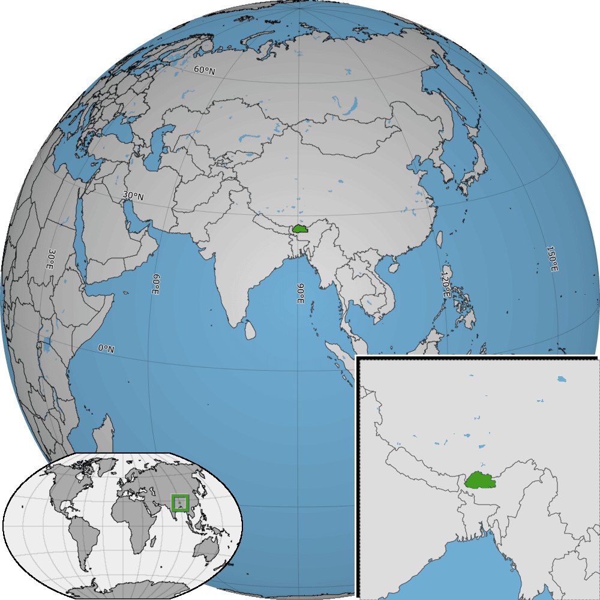

# Locator Maps (ISO Country & Territory Codes)

This repository contains public‑domain locator maps for countries and territories using ISO‑3166‑1 alpha‑2 two‑letter codes.

for example, here is a locator map for [Bhutan](https://en.wikipedia.org/wiki/Bhutan):



Each locator map is available in both **SVG** and **PNG** formats. Files are named using the lowercase ISO code:

- `pngs/<code>.png` — e.g., `pngs/af.png`
- `svgs/<code>.svg` — e.g., `svgs/af.svg`

## Licenses

The majority of these maps were created by me, using [pythonshd](https://github.com/sanjayrao77/pythonshd) and open-source geospatial data files. These are licensed in the **Public Domain**.

For some countries and territories, I could not generate a locator map directly. For example, Svalbard Island (SJ) is owned by Norway, but [pythonshd] does not include a geographic target for just Svalbard and instead would produce a locator map of all of Norway's territories. Additionally, some territories with ISO codes, such as Christmas Island (CX), didn't have a geographic target at all in [pythonshd]. For these locations, I downloaded a locator map in SVG from Wikipedia. These come with various licenses  and carry **Creative Commons licenses** rather than being in the public domain. These are clearly separated and retain their original licensing notices.

## Country & Territory Locator Maps

The following table contains the Country & Territory Maps in this repo, including links to the SVG and PNG images, and their license.

<table>
  <thead>
    <tr><th>Code</th><th>Country / Territory</th><th>PNG</th><th>SVG</th><th>License</th></tr>
  </thead>
  <tbody>
    <tr><td>AD</td><td>Andorra</td><td><a href="pngs/ad.png"> 🖼️ PNG</a></td><td><a href="svgs/ad.svg"> 🎨 SVG</a></td><td>Public Domain</td></tr>
    <tr><td>AE</td><td>United Arab Emirates</td><td><a href="pngs/ae.png"> 🖼️ PNG</a></td><td><a href="svgs/ae.svg"> 🎨 SVG</a></td><td>Public Domain</td></tr>
    <tr><td>AG</td><td>Antigua and Barbuda</td><td><a href="pngs/ag.png"> 🖼️ PNG</a></td><td><a href="svgs/ag.svg"> 🎨 SVG</a></td><td>Public Domain</td></tr>
    <tr><td>AI</td><td>Anguilla</td><td><a href="pngs/ai.png"> 🖼️ PNG</a></td><td><a href="svgs/ai.svg"> 🎨 SVG</a></td><td>Public Domain</td></tr>
    <tr><td>AL</td><td>Albania</td><td><a href="pngs/al.png"> 🖼️ PNG</a></td><td><a href="svgs/al.svg"> 🎨 SVG</a></td><td>Public Domain</td></tr>
    <tr><td>AM</td><td>Armenia</td><td><a href="pngs/am.png"> 🖼️ PNG</a></td><td><a href="svgs/am.svg"> 🎨 SVG</a></td><td>Public Domain</td></tr>
    <tr><td>AO</td><td>Angola</td><td><a href="pngs/ao.png"> 🖼️ PNG</a></td><td><a href="svgs/ao.svg"> 🎨 SVG</a></td><td>Public Domain</td></tr>
    <tr><td>AQ</td><td>Antarctica</td><td><a href="pngs/aq.png"> 🖼️ PNG</a></td><td><a href="svgs/aq.svg"> 🎨 SVG</a></td><td>Public Domain</td></tr>
    <tr><td>AR</td><td>Argentina</td><td><a href="pngs/ar.png"> 🖼️ PNG</a></td><td><a href="svgs/ar.svg"> 🎨 SVG</a></td><td>Public Domain</td></tr>
    <tr><td>AS</td><td>American Samoa</td><td><a href="pngs/as.png"> 🖼️ PNG</a></td><td><a href="svgs/as.svg"> 🎨 SVG</a></td><td>Public Domain</td></tr>
    <tr><td>AT</td><td>Austria</td><td><a href="pngs/at.png"> 🖼️ PNG</a></td><td><a href="svgs/at.svg"> 🎨 SVG</a></td><td>Public Domain</td></tr>
    <tr><td>AU</td><td>Australia</td><td><a href="pngs/au.png"> 🖼️ PNG</a></td><td><a href="svgs/au.svg"> 🎨 SVG</a></td><td>Public Domain</td></tr>
    <tr><td>AW</td><td>Aruba</td><td><a href="pngs/aw.png"> 🖼️ PNG</a></td><td><a href="svgs/aw.svg"> 🎨 SVG</a></td><td>Public Domain</td></tr>
    <tr><td>AX</td><td>Åland</td><td><a href="pngs/ax.png"> 🖼️ PNG</a></td><td><a href="svgs/ax.svg"> 🎨 SVG</a></td><td>Public Domain</td></tr>
    <tr><td>AZ</td><td>Azerbaijan</td><td><a href="pngs/az.png"> 🖼️ PNG</a></td><td><a href="svgs/az.svg"> 🎨 SVG</a></td><td>Public Domain</td></tr>
    <tr><td>BA</td><td>Bosnia and Herzegovina</td><td><a href="pngs/ba.png"> 🖼️ PNG</a></td><td><a href="svgs/ba.svg"> 🎨 SVG</a></td><td>Public Domain</td></tr>
    <tr><td>BB</td><td>Barbados</td><td><a href="pngs/bb.png"> 🖼️ PNG</a></td><td><a href="svgs/bb.svg"> 🎨 SVG</a></td><td>Public Domain</td></tr>
    <tr><td>BD</td><td>Bangladesh</td><td><a href="pngs/bd.png"> 🖼️ PNG</a></td><td><a href="svgs/bd.svg"> 🎨 SVG</a></td><td>Public Domain</td></tr>
    <tr><td>BE</td><td>Belgium</td><td><a href="pngs/be.png"> 🖼️ PNG</a></td><td><a href="svgs/be.svg"> 🎨 SVG</a></td><td>Public Domain</td></tr>
    <tr><td>BF</td><td>Burkina Faso</td><td><a href="pngs/bf.png"> 🖼️ PNG</a></td><td><a href="svgs/bf.svg"> 🎨 SVG</a></td><td>Public Domain</td></tr>
    <tr><td>BG</td><td>Bulgaria</td><td><a href="pngs/bg.png"> 🖼️ PNG</a></td><td><a href="svgs/bg.svg"> 🎨 SVG</a></td><td>Public Domain</td></tr>
    <tr><td>BH</td><td>Bahrain</td><td><a href="pngs/bh.png"> 🖼️ PNG</a></td><td><a href="svgs/bh.svg"> 🎨 SVG</a></td><td>Public Domain</td></tr>
    <tr><td>BI</td><td>Burundi</td><td><a href="pngs/bi.png"> 🖼️ PNG</a></td><td><a href="svgs/bi.svg"> 🎨 SVG</a></td><td>Public Domain</td></tr>
    <tr><td>BJ</td><td>Benin</td><td><a href="pngs/bj.png"> 🖼️ PNG</a></td><td><a href="svgs/bj.svg"> 🎨 SVG</a></td><td>Public Domain</td></tr>
    <tr><td>BL</td><td>Saint Barts</td><td><a href="pngs/bl.png"> 🖼️ PNG</a></td><td><a href="svgs/bl.svg"> 🎨 SVG</a></td><td>Public Domain</td></tr>
    <tr><td>BM</td><td>Bermuda</td><td><a href="pngs/bm.png"> 🖼️ PNG</a></td><td><a href="svgs/bm.svg"> 🎨 SVG</a></td><td>Public Domain</td></tr>
    <tr><td>BN</td><td>Brunei</td><td><a href="pngs/bn.png"> 🖼️ PNG</a></td><td><a href="svgs/bn.svg"> 🎨 SVG</a></td><td>Public Domain</td></tr>
    <tr><td>BO</td><td>Bolivia</td><td><a href="pngs/bo.png"> 🖼️ PNG</a></td><td><a href="svgs/bo.svg"> 🎨 SVG</a></td><td>Public Domain</td></tr>
    <tr><td>BR</td><td>Brazil</td><td><a href="pngs/br.png"> 🖼️ PNG</a></td><td><a href="svgs/br.svg"> 🎨 SVG</a></td><td>Public Domain</td></tr>
    <tr><td>BS</td><td>Bahamas</td><td><a href="pngs/bs.png"> 🖼️ PNG</a></td><td><a href="svgs/bs.svg"> 🎨 SVG</a></td><td>Public Domain</td></tr>
    <tr><td>BT</td><td>Bhutan</td><td><a href="pngs/bt.png"> 🖼️ PNG</a></td><td><a href="svgs/bt.svg"> 🎨 SVG</a></td><td>Public Domain</td></tr>
    <tr><td>BV</td><td>Bouvet Island</td><td><a href="pngs/bv.png"> 🖼️ PNG</a></td><td><a href="svgs/bv.svg"> 🎨 SVG</a></td><td><a href="https://commons.wikimedia.org/wiki/File:Bouvet_Island_on_the_globe_(Antarctica_centered).svg">Wikipedia Source: CC BY-SA 3.0</a></td></tr>
    <tr><td>BW</td><td>Botswana</td><td><a href="pngs/bw.png"> 🖼️ PNG</a></td><td><a href="svgs/bw.svg"> 🎨 SVG</a></td><td>Public Domain</td></tr>
    <tr><td>BY</td><td>Belarus</td><td><a href="pngs/by.png"> 🖼️ PNG</a></td><td><a href="svgs/by.svg"> 🎨 SVG</a></td><td>Public Domain</td></tr>
    <tr><td>BZ</td><td>Belize</td><td><a href="pngs/bz.png"> 🖼️ PNG</a></td><td><a href="svgs/bz.svg"> 🎨 SVG</a></td><td>Public Domain</td></tr>
    <tr><td>CA</td><td>Canada</td><td><a href="pngs/ca.png"> 🖼️ PNG</a></td><td><a href="svgs/ca.svg"> 🎨 SVG</a></td><td>Public Domain</td></tr>
    <tr><td>CC</td><td>Cocos (Keeling) Islands</td><td><a href="pngs/cc.png"> 🖼️ PNG</a></td><td><a href="svgs/cc.svg"> 🎨 SVG</a></td><td><a href="https://commons.wikimedia.org/wiki/File:Australia_on_the_globe_(Cocos_(Keeling)_Islands_special)_(Southeast_Asia_centered).svg">Wikipedia Source: CC BY-SA 3.0</a></td></tr>
    <tr><td>CD</td><td>Democratic Republic of the Congo</td><td><a href="pngs/cd.png"> 🖼️ PNG</a></td><td><a href="svgs/cd.svg"> 🎨 SVG</a></td><td>Public Domain</td></tr>
    <tr><td>CF</td><td>Central African Republic</td><td><a href="pngs/cf.png"> 🖼️ PNG</a></td><td><a href="svgs/cf.svg"> 🎨 SVG</a></td><td>Public Domain</td></tr>
    <tr><td>CG</td><td>Congo</td><td><a href="pngs/cg.png"> 🖼️ PNG</a></td><td><a href="svgs/cg.svg"> 🎨 SVG</a></td><td>Public Domain</td></tr>
    <tr><td>CH</td><td>Switzerland</td><td><a href="pngs/ch.png"> 🖼️ PNG</a></td><td><a href="svgs/ch.svg"> 🎨 SVG</a></td><td>Public Domain</td></tr>
    <tr><td>CI</td><td>Côte d'Ivoire</td><td><a href="pngs/ci.png"> 🖼️ PNG</a></td><td><a href="svgs/ci.svg"> 🎨 SVG</a></td><td>Public Domain</td></tr>
    <tr><td>CK</td><td>Cook Islands</td><td><a href="pngs/ck.png"> 🖼️ PNG</a></td><td><a href="svgs/ck.svg"> 🎨 SVG</a></td><td>Public Domain</td></tr>
    <tr><td>CL</td><td>Chile</td><td><a href="pngs/cl.png"> 🖼️ PNG</a></td><td><a href="svgs/cl.svg"> 🎨 SVG</a></td><td>Public Domain</td></tr>
    <tr><td>CM</td><td>Cameroon</td><td><a href="pngs/cm.png"> 🖼️ PNG</a></td><td><a href="svgs/cm.svg"> 🎨 SVG</a></td><td>Public Domain</td></tr>
    <tr><td>CN</td><td>China</td><td><a href="pngs/cn.png"> 🖼️ PNG</a></td><td><a href="svgs/cn.svg"> 🎨 SVG</a></td><td>Public Domain</td></tr>
    <tr><td>CO</td><td>Colombia</td><td><a href="pngs/co.png"> 🖼️ PNG</a></td><td><a href="svgs/co.svg"> 🎨 SVG</a></td><td>Public Domain</td></tr>
    <tr><td>CR</td><td>Costa Rica</td><td><a href="pngs/cr.png"> 🖼️ PNG</a></td><td><a href="svgs/cr.svg"> 🎨 SVG</a></td><td>Public Domain</td></tr>
    <tr><td>CU</td><td>Cuba</td><td><a href="pngs/cu.png"> 🖼️ PNG</a></td><td><a href="svgs/cu.svg"> 🎨 SVG</a></td><td>Public Domain</td></tr>
    <tr><td>CV</td><td>Cape Verde</td><td><a href="pngs/cv.png"> 🖼️ PNG</a></td><td><a href="svgs/cv.svg"> 🎨 SVG</a></td><td>Public Domain</td></tr>
    <tr><td>CW</td><td>Curaçao</td><td><a href="pngs/cw.png"> 🖼️ PNG</a></td><td><a href="svgs/cw.svg"> 🎨 SVG</a></td><td>Public Domain</td></tr>
    <tr><td>CX</td><td>Christmas Island</td><td><a href="pngs/cx.png"> 🖼️ PNG</a></td><td><a href="svgs/cx.svg"> 🎨 SVG</a></td><td><a href="https://commons.wikimedia.org/wiki/File:Australia_on_the_globe_(Christmas_Island_special)_(Southeast_Asia_centered).svg">Wikipedia Source (CC BY-SA 3.0)</a></td></tr>
    <tr><td>CY</td><td>Cyprus</td><td><a href="pngs/cy.png"> 🖼️ PNG</a></td><td><a href="svgs/cy.svg"> 🎨 SVG</a></td><td>Public Domain</td></tr>
    <tr><td>CZ</td><td>Czechia</td><td><a href="pngs/cz.png"> 🖼️ PNG</a></td><td><a href="svgs/cz.svg"> 🎨 SVG</a></td><td>Public Domain</td></tr>
    <tr><td>DE</td><td>Germany</td><td><a href="pngs/de.png"> 🖼️ PNG</a></td><td><a href="svgs/de.svg"> 🎨 SVG</a></td><td>Public Domain</td></tr>
    <tr><td>DJ</td><td>Djibouti</td><td><a href="pngs/dj.png"> 🖼️ PNG</a></td><td><a href="svgs/dj.svg"> 🎨 SVG</a></td><td>Public Domain</td></tr>
    <tr><td>DK</td><td>Denmark</td><td><a href="pngs/dk.png"> 🖼️ PNG</a></td><td><a href="svgs/dk.svg"> 🎨 SVG</a></td><td>Public Domain</td></tr>
    <tr><td>DM</td><td>Dominica</td><td><a href="pngs/dm.png"> 🖼️ PNG</a></td><td><a href="svgs/dm.svg"> 🎨 SVG</a></td><td>Public Domain</td></tr>
    <tr><td>DO</td><td>Dominican Republic</td><td><a href="pngs/do.png"> 🖼️ PNG</a></td><td><a href="svgs/do.svg"> 🎨 SVG</a></td><td>Public Domain</td></tr>
    <tr><td>DZ</td><td>Algeria</td><td><a href="pngs/dz.png"> 🖼️ PNG</a></td><td><a href="svgs/dz.svg"> 🎨 SVG</a></td><td>Public Domain</td></tr>
    <tr><td>EC</td><td>Ecuador</td><td><a href="pngs/ec.png"> 🖼️ PNG</a></td><td><a href="svgs/ec.svg"> 🎨 SVG</a></td><td>Public Domain</td></tr>
    <tr><td>EE</td><td>Estonia</td><td><a href="pngs/ee.png"> 🖼️ PNG</a></td><td><a href="svgs/ee.svg"> 🎨 SVG</a></td><td>Public Domain</td></tr>
    <tr><td>EG</td><td>Egypt</td><td><a href="pngs/eg.png"> 🖼️ PNG</a></td><td><a href="svgs/eg.svg"> 🎨 SVG</a></td><td>Public Domain</td></tr>
    <tr><td>EH</td><td>Western Sahara</td><td><a href="pngs/eh.png"> 🖼️ PNG</a></td><td><a href="svgs/eh.svg"> 🎨 SVG</a></td><td>Public Domain</td></tr>
    <tr><td>ER</td><td>Eritrea</td><td><a href="pngs/er.png"> 🖼️ PNG</a></td><td><a href="svgs/er.svg"> 🎨 SVG</a></td><td>Public Domain</td></tr>
    <tr><td>ES</td><td>Spain</td><td><a href="pngs/es.png"> 🖼️ PNG</a></td><td><a href="svgs/es.svg"> 🎨 SVG</a></td><td>Public Domain</td></tr>
    <tr><td>ET</td><td>Ethiopia</td><td><a href="pngs/et.png"> 🖼️ PNG</a></td><td><a href="svgs/et.svg"> 🎨 SVG</a></td><td>Public Domain</td></tr>
    <tr><td>FI</td><td>Finland</td><td><a href="pngs/fi.png"> 🖼️ PNG</a></td><td><a href="svgs/fi.svg"> 🎨 SVG</a></td><td>Public Domain</td></tr>
    <tr><td>FJ</td><td>Fiji</td><td><a href="pngs/fj.png"> 🖼️ PNG</a></td><td><a href="svgs/fj.svg"> 🎨 SVG</a></td><td>Public Domain</td></tr>
    <tr><td>FK</td><td>Falkland Islands (Malvinas)</td><td><a href="pngs/fk.png"> 🖼️ PNG</a></td><td><a href="svgs/fk.svg"> 🎨 SVG</a></td><td>Public Domain</td></tr>
    <tr><td>FM</td><td>Federated States of Micronesia</td><td><a href="pngs/fm.png"> 🖼️ PNG</a></td><td><a href="svgs/fm.svg"> 🎨 SVG</a></td><td>Public Domain</td></tr>
    <tr><td>FO</td><td>Faroe Islands</td><td><a href="pngs/fo.png"> 🖼️ PNG</a></td><td><a href="svgs/fo.svg"> 🎨 SVG</a></td><td>Public Domain</td></tr>
    <tr><td>FR</td><td>France</td><td><a href="pngs/fr.png"> 🖼️ PNG</a></td><td><a href="svgs/fr.svg"> 🎨 SVG</a></td><td>Public Domain</td></tr>
    <tr><td>GA</td><td>Gabon</td><td><a href="pngs/ga.png"> 🖼️ PNG</a></td><td><a href="svgs/ga.svg"> 🎨 SVG</a></td><td>Public Domain</td></tr>
    <tr><td>GB</td><td>United Kingdom</td><td><a href="pngs/gb.png"> 🖼️ PNG</a></td><td><a href="svgs/gb.svg"> 🎨 SVG</a></td><td>Public Domain</td></tr>
    <tr><td>GD</td><td>Grenada</td><td><a href="pngs/gd.png"> 🖼️ PNG</a></td><td><a href="svgs/gd.svg"> 🎨 SVG</a></td><td>Public Domain</td></tr>
    <tr><td>GE</td><td>Georgia</td><td><a href="pngs/ge.png"> 🖼️ PNG</a></td><td><a href="svgs/ge.svg"> 🎨 SVG</a></td><td>Public Domain</td></tr>
    <tr><td>GF</td><td>French Guiana</td><td><a href="pngs/gf.png"> 🖼️ PNG</a></td><td><a href="svgs/gf.svg"> 🎨 SVG</a></td><td>Public Domain</td></tr>
    <tr><td>GG</td><td>Guernsey</td><td><a href="pngs/gg.png"> 🖼️ PNG</a></td><td><a href="svgs/gg.svg"> 🎨 SVG</a></td><td>Public Domain</td></tr>
    <tr><td>GH</td><td>Ghana</td><td><a href="pngs/gh.png"> 🖼️ PNG</a></td><td><a href="svgs/gh.svg"> 🎨 SVG</a></td><td>Public Domain</td></tr>
    <tr><td>GI</td><td>Gibraltar</td><td><a href="pngs/gi.png"> 🖼️ PNG</a></td><td><a href="svgs/gi.svg"> 🎨 SVG</a></td><td>Public Domain</td></tr>
    <tr><td>GL</td><td>Greenland</td><td><a href="pngs/gl.png"> 🖼️ PNG</a></td><td><a href="svgs/gl.svg"> 🎨 SVG</a></td><td>Public Domain</td></tr>
    <tr><td>GM</td><td>Gambia</td><td><a href="pngs/gm.png"> 🖼️ PNG</a></td><td><a href="svgs/gm.svg"> 🎨 SVG</a></td><td>Public Domain</td></tr>
    <tr><td>GN</td><td>Guinea</td><td><a href="pngs/gn.png"> 🖼️ PNG</a></td><td><a href="svgs/gn.svg"> 🎨 SVG</a></td><td>Public Domain</td></tr>
    <tr><td>GP</td><td>Guadeloupe</td><td><a href="pngs/gp.png"> 🖼️ PNG</a></td><td><a href="svgs/gp.svg"> 🎨 SVG</a></td><td>Public Domain</td></tr>
    <tr><td>GQ</td><td>Equatorial Guinea</td><td><a href="pngs/gq.png"> 🖼️ PNG</a></td><td><a href="svgs/gq.svg"> 🎨 SVG</a></td><td>Public Domain</td></tr>
    <tr><td>GR</td><td>Greece</td><td><a href="pngs/gr.png"> 🖼️ PNG</a></td><td><a href="svgs/gr.svg"> 🎨 SVG</a></td><td>Public Domain</td></tr>
    <tr><td>GS</td><td>South Georgia and the South Sandwich Islands</td><td><a href="pngs/gs.png"> 🖼️ PNG</a></td><td><a href="svgs/gs.svg"> 🎨 SVG</a></td><td>Public Domain</td></tr>
    <tr><td>GT</td><td>Guatemala</td><td><a href="pngs/gt.png"> 🖼️ PNG</a></td><td><a href="svgs/gt.svg"> 🎨 SVG</a></td><td>Public Domain</td></tr>
    <tr><td>GU</td><td>Guam</td><td><a href="pngs/gu.png"> 🖼️ PNG</a></td><td><a href="svgs/gu.svg"> 🎨 SVG</a></td><td>Public Domain</td></tr>
    <tr><td>GW</td><td>Guinea-Bissau</td><td><a href="pngs/gw.png"> 🖼️ PNG</a></td><td><a href="svgs/gw.svg"> 🎨 SVG</a></td><td>Public Domain</td></tr>
    <tr><td>GY</td><td>Guyana</td><td><a href="pngs/gy.png"> 🖼️ PNG</a></td><td><a href="svgs/gy.svg"> 🎨 SVG</a></td><td>Public Domain</td></tr>
    <tr><td>HK</td><td>Hong Kong</td><td><a href="pngs/hk.png"> 🖼️ PNG</a></td><td><a href="svgs/hk.svg"> 🎨 SVG</a></td><td>Public Domain</td></tr>
    <tr><td>HM</td><td>Heard Island and McDonald Islands</td><td><a href="pngs/hm.png"> 🖼️ PNG</a></td><td><a href="svgs/hm.svg"> 🎨 SVG</a></td><td>Public Domain</td></tr>
    <tr><td>HN</td><td>Honduras</td><td><a href="pngs/hn.png"> 🖼️ PNG</a></td><td><a href="svgs/hn.svg"> 🎨 SVG</a></td><td>Public Domain</td></tr>
    <tr><td>HR</td><td>Croatia</td><td><a href="pngs/hr.png"> 🖼️ PNG</a></td><td><a href="svgs/hr.svg"> 🎨 SVG</a></td><td>Public Domain</td></tr>
    <tr><td>HT</td><td>Haiti</td><td><a href="pngs/ht.png"> 🖼️ PNG</a></td><td><a href="svgs/ht.svg"> 🎨 SVG</a></td><td>Public Domain</td></tr>
    <tr><td>HU</td><td>Hungary</td><td><a href="pngs/hu.png"> 🖼️ PNG</a></td><td><a href="svgs/hu.svg"> 🎨 SVG</a></td><td>Public Domain</td></tr>
    <tr><td>ID</td><td>Indonesia</td><td><a href="pngs/id.png"> 🖼️ PNG</a></td><td><a href="svgs/id.svg"> 🎨 SVG</a></td><td>Public Domain</td></tr>
    <tr><td>IE</td><td>Ireland</td><td><a href="pngs/ie.png"> 🖼️ PNG</a></td><td><a href="svgs/ie.svg"> 🎨 SVG</a></td><td>Public Domain</td></tr>
    <tr><td>IL</td><td>Israel</td><td><a href="pngs/il.png"> 🖼️ PNG</a></td><td><a href="svgs/il.svg"> 🎨 SVG</a></td><td>Public Domain</td></tr>
    <tr><td>IM</td><td>Isle of Man</td><td><a href="pngs/im.png"> 🖼️ PNG</a></td><td><a href="svgs/im.svg"> 🎨 SVG</a></td><td>Public Domain</td></tr>
    <tr><td>IN</td><td>India</td><td><a href="pngs/in.png"> 🖼️ PNG</a></td><td><a href="svgs/in.svg"> 🎨 SVG</a></td><td>Public Domain</td></tr>
    <tr><td>IO</td><td>British Indian Ocean Territory (Diego Garcia)</td><td><a href="pngs/io.png"> 🖼️ PNG</a></td><td><a href="svgs/io.svg"> 🎨 SVG</a></td><td>Public Domain</td></tr>
    <tr><td>IQ</td><td>Iraq</td><td><a href="pngs/iq.png"> 🖼️ PNG</a></td><td><a href="svgs/iq.svg"> 🎨 SVG</a></td><td>Public Domain</td></tr>
    <tr><td>IR</td><td>Iran</td><td><a href="pngs/ir.png"> 🖼️ PNG</a></td><td><a href="svgs/ir.svg"> 🎨 SVG</a></td><td>Public Domain</td></tr>
    <tr><td>IS</td><td>Iceland</td><td><a href="pngs/is.png"> 🖼️ PNG</a></td><td><a href="svgs/is.svg"> 🎨 SVG</a></td><td>Public Domain</td></tr>
    <tr><td>IT</td><td>Italy</td><td><a href="pngs/it.png"> 🖼️ PNG</a></td><td><a href="svgs/it.svg"> 🎨 SVG</a></td><td>Public Domain</td></tr>
    <tr><td>JE</td><td>Jersey</td><td><a href="pngs/je.png"> 🖼️ PNG</a></td><td><a href="svgs/je.svg"> 🎨 SVG</a></td><td>Public Domain</td></tr>
    <tr><td>JM</td><td>Jamaica</td><td><a href="pngs/jm.png"> 🖼️ PNG</a></td><td><a href="svgs/jm.svg"> 🎨 SVG</a></td><td>Public Domain</td></tr>
    <tr><td>JO</td><td>Jordan</td><td><a href="pngs/jo.png"> 🖼️ PNG</a></td><td><a href="svgs/jo.svg"> 🎨 SVG</a></td><td>Public Domain</td></tr>
    <tr><td>JP</td><td>Japan</td><td><a href="pngs/jp.png"> 🖼️ PNG</a></td><td><a href="svgs/jp.svg"> 🎨 SVG</a></td><td>Public Domain</td></tr>
    <tr><td>KE</td><td>Kenya</td><td><a href="pngs/ke.png"> 🖼️ PNG</a></td><td><a href="svgs/ke.svg"> 🎨 SVG</a></td><td>Public Domain</td></tr>
    <tr><td>KG</td><td>Kyrgyzstan</td><td><a href="pngs/kg.png"> 🖼️ PNG</a></td><td><a href="svgs/kg.svg"> 🎨 SVG</a></td><td>Public Domain</td></tr>
    <tr><td>KH</td><td>Cambodia</td><td><a href="pngs/kh.png"> 🖼️ PNG</a></td><td><a href="svgs/kh.svg"> 🎨 SVG</a></td><td>Public Domain</td></tr>
    <tr><td>KI</td><td>Kiribati</td><td><a href="pngs/ki.png"> 🖼️ PNG</a></td><td><a href="svgs/ki.svg"> 🎨 SVG</a></td><td>Public Domain</td></tr>
    <tr><td>KM</td><td>Comoros</td><td><a href="pngs/km.png"> 🖼️ PNG</a></td><td><a href="svgs/km.svg"> 🎨 SVG</a></td><td>Public Domain</td></tr>
    <tr><td>KN</td><td>Saint Kitts and Nevis</td><td><a href="pngs/kn.png"> 🖼️ PNG</a></td><td><a href="svgs/kn.svg"> 🎨 SVG</a></td><td>Public Domain</td></tr>
    <tr><td>KP</td><td>North Korea</td><td><a href="pngs/kp.png"> 🖼️ PNG</a></td><td><a href="svgs/kp.svg"> 🎨 SVG</a></td><td>Public Domain</td></tr>
    <tr><td>KR</td><td>South Korea</td><td><a href="pngs/kr.png"> 🖼️ PNG</a></td><td><a href="svgs/kr.svg"> 🎨 SVG</a></td><td>Public Domain</td></tr>
    <tr><td>KW</td><td>Kuwait</td><td><a href="pngs/kw.png"> 🖼️ PNG</a></td><td><a href="svgs/kw.svg"> 🎨 SVG</a></td><td>Public Domain</td></tr>
    <tr><td>KY</td><td>Cayman Islands</td><td><a href="pngs/ky.png"> 🖼️ PNG</a></td><td><a href="svgs/ky.svg"> 🎨 SVG</a></td><td>Public Domain</td></tr>
    <tr><td>KZ</td><td>Kazakhstan</td><td><a href="pngs/kz.png"> 🖼️ PNG</a></td><td><a href="svgs/kz.svg"> 🎨 SVG</a></td><td>Public Domain</td></tr>
    <tr><td>LA</td><td>Laos</td><td><a href="pngs/la.png"> 🖼️ PNG</a></td><td><a href="svgs/la.svg"> 🎨 SVG</a></td><td>Public Domain</td></tr>
    <tr><td>LB</td><td>Lebanon</td><td><a href="pngs/lb.png"> 🖼️ PNG</a></td><td><a href="svgs/lb.svg"> 🎨 SVG</a></td><td>Public Domain</td></tr>
    <tr><td>LC</td><td>Saint Lucia</td><td><a href="pngs/lc.png"> 🖼️ PNG</a></td><td><a href="svgs/lc.svg"> 🎨 SVG</a></td><td>Public Domain</td></tr>
    <tr><td>LI</td><td>Liechtenstein</td><td><a href="pngs/li.png"> 🖼️ PNG</a></td><td><a href="svgs/li.svg"> 🎨 SVG</a></td><td>Public Domain</td></tr>
    <tr><td>LK</td><td>Sri Lanka</td><td><a href="pngs/lk.png"> 🖼️ PNG</a></td><td><a href="svgs/lk.svg"> 🎨 SVG</a></td><td>Public Domain</td></tr>
    <tr><td>LR</td><td>Liberia</td><td><a href="pngs/lr.png"> 🖼️ PNG</a></td><td><a href="svgs/lr.svg"> 🎨 SVG</a></td><td>Public Domain</td></tr>
    <tr><td>LS</td><td>Lesotho</td><td><a href="pngs/ls.png"> 🖼️ PNG</a></td><td><a href="svgs/ls.svg"> 🎨 SVG</a></td><td>Public Domain</td></tr>
    <tr><td>LT</td><td>Lithuania</td><td><a href="pngs/lt.png"> 🖼️ PNG</a></td><td><a href="svgs/lt.svg"> 🎨 SVG</a></td><td>Public Domain</td></tr>
    <tr><td>LU</td><td>Luxembourg</td><td><a href="pngs/lu.png"> 🖼️ PNG</a></td><td><a href="svgs/lu.svg"> 🎨 SVG</a></td><td>Public Domain</td></tr>
    <tr><td>LV</td><td>Latvia</td><td><a href="pngs/lv.png"> 🖼️ PNG</a></td><td><a href="svgs/lv.svg"> 🎨 SVG</a></td><td>Public Domain</td></tr>
    <tr><td>LY</td><td>Libya</td><td><a href="pngs/ly.png"> 🖼️ PNG</a></td><td><a href="svgs/ly.svg"> 🎨 SVG</a></td><td>Public Domain</td></tr>
    <tr><td>MA</td><td>Morocco</td><td><a href="pngs/ma.png"> 🖼️ PNG</a></td><td><a href="svgs/ma.svg"> 🎨 SVG</a></td><td>Public Domain</td></tr>
    <tr><td>MC</td><td>Monaco</td><td><a href="pngs/mc.png"> 🖼️ PNG</a></td><td><a href="svgs/mc.svg"> 🎨 SVG</a></td><td>Public Domain</td></tr>
    <tr><td>MD</td><td>Moldova</td><td><a href="pngs/md.png"> 🖼️ PNG</a></td><td><a href="svgs/md.svg"> 🎨 SVG</a></td><td>Public Domain</td></tr>
    <tr><td>ME</td><td>Montenegro</td><td><a href="pngs/me.png"> 🖼️ PNG</a></td><td><a href="svgs/me.svg"> 🎨 SVG</a></td><td>Public Domain</td></tr>
    <tr><td>MF</td><td>Saint Martin (French)</td><td><a href="pngs/mf.png"> 🖼️ PNG</a></td><td><a href="svgs/mf.svg"> 🎨 SVG</a></td><td>Public Domain</td></tr>
    <tr><td>MG</td><td>Madagascar</td><td><a href="pngs/mg.png"> 🖼️ PNG</a></td><td><a href="svgs/mg.svg"> 🎨 SVG</a></td><td>Public Domain</td></tr>
    <tr><td>MH</td><td>Marshall Islands</td><td><a href="pngs/mh.png"> 🖼️ PNG</a></td><td><a href="svgs/mh.svg"> 🎨 SVG</a></td><td>Public Domain</td></tr>
    <tr><td>MK</td><td>North Macedonia</td><td><a href="pngs/mk.png"> 🖼️ PNG</a></td><td><a href="svgs/mk.svg"> 🎨 SVG</a></td><td>Public Domain</td></tr>
    <tr><td>ML</td><td>Mali</td><td><a href="pngs/ml.png"> 🖼️ PNG</a></td><td><a href="svgs/ml.svg"> 🎨 SVG</a></td><td>Public Domain</td></tr>
    <tr><td>MM</td><td>Myanmar</td><td><a href="pngs/mm.png"> 🖼️ PNG</a></td><td><a href="svgs/mm.svg"> 🎨 SVG</a></td><td>Public Domain</td></tr>
    <tr><td>MN</td><td>Mongolia</td><td><a href="pngs/mn.png"> 🖼️ PNG</a></td><td><a href="svgs/mn.svg"> 🎨 SVG</a></td><td>Public Domain</td></tr>
    <tr><td>MO</td><td>Macau</td><td><a href="pngs/mo.png"> 🖼️ PNG</a></td><td><a href="svgs/mo.svg"> 🎨 SVG</a></td><td>Public Domain</td></tr>
    <tr><td>MP</td><td>Northern Mariana Islands</td><td><a href="pngs/mp.png"> 🖼️ PNG</a></td><td><a href="svgs/mp.svg"> 🎨 SVG</a></td><td>Public Domain</td></tr>
    <tr><td>MR</td><td>Mauritania</td><td><a href="pngs/mr.png"> 🖼️ PNG</a></td><td><a href="svgs/mr.svg"> 🎨 SVG</a></td><td>Public Domain</td></tr>
    <tr><td>MS</td><td>Montserrat</td><td><a href="pngs/ms.png"> 🖼️ PNG</a></td><td><a href="svgs/ms.svg"> 🎨 SVG</a></td><td>Public Domain</td></tr>
    <tr><td>MT</td><td>Malta</td><td><a href="pngs/mt.png"> 🖼️ PNG</a></td><td><a href="svgs/mt.svg"> 🎨 SVG</a></td><td>Public Domain</td></tr>
    <tr><td>MU</td><td>Mauritius</td><td><a href="pngs/mu.png"> 🖼️ PNG</a></td><td><a href="svgs/mu.svg"> 🎨 SVG</a></td><td>Public Domain</td></tr>
    <tr><td>MV</td><td>Maldives</td><td><a href="pngs/mv.png"> 🖼️ PNG</a></td><td><a href="svgs/mv.svg"> 🎨 SVG</a></td><td>Public Domain</td></tr>
    <tr><td>MW</td><td>Malawi</td><td><a href="pngs/mw.png"> 🖼️ PNG</a></td><td><a href="svgs/mw.svg"> 🎨 SVG</a></td><td>Public Domain</td></tr>
    <tr><td>MX</td><td>Mexico</td><td><a href="pngs/mx.png"> 🖼️ PNG</a></td><td><a href="svgs/mx.svg"> 🎨 SVG</a></td><td>Public Domain</td></tr>
    <tr><td>MY</td><td>Malaysia</td><td><a href="pngs/my.png"> 🖼️ PNG</a></td><td><a href="svgs/my.svg"> 🎨 SVG</a></td><td>Public Domain</td></tr>
    <tr><td>MZ</td><td>Mozambique</td><td><a href="pngs/mz.png"> 🖼️ PNG</a></td><td><a href="svgs/mz.svg"> 🎨 SVG</a></td><td>Public Domain</td></tr>
    <tr><td>NA</td><td>Namibia</td><td><a href="pngs/na.png"> 🖼️ PNG</a></td><td><a href="svgs/na.svg"> 🎨 SVG</a></td><td>Public Domain</td></tr>
    <tr><td>NC</td><td>New Caledonia</td><td><a href="pngs/nc.png"> 🖼️ PNG</a></td><td><a href="svgs/nc.svg"> 🎨 SVG</a></td><td>Public Domain</td></tr>
    <tr><td>NE</td><td>Niger</td><td><a href="pngs/ne.png"> 🖼️ PNG</a></td><td><a href="svgs/ne.svg"> 🎨 SVG</a></td><td>Public Domain</td></tr>
    <tr><td>NF</td><td>Norfolk Island</td><td><a href="pngs/nf.png"> 🖼️ PNG</a></td><td><a href="svgs/nf.svg"> 🎨 SVG</a></td><td>Public Domain</td></tr>
    <tr><td>NG</td><td>Nigeria</td><td><a href="pngs/ng.png"> 🖼️ PNG</a></td><td><a href="svgs/ng.svg"> 🎨 SVG</a></td><td>Public Domain</td></tr>
    <tr><td>NI</td><td>Nicaragua</td><td><a href="pngs/ni.png"> 🖼️ PNG</a></td><td><a href="svgs/ni.svg"> 🎨 SVG</a></td><td>Public Domain</td></tr>
    <tr><td>NL</td><td>Netherlands</td><td><a href="pngs/nl.png"> 🖼️ PNG</a></td><td><a href="svgs/nl.svg"> 🎨 SVG</a></td><td>Public Domain</td></tr>
    <tr><td>NO</td><td>Norway</td><td><a href="pngs/no.png"> 🖼️ PNG</a></td><td><a href="svgs/no.svg"> 🎨 SVG</a></td><td>Public Domain</td></tr>
    <tr><td>NP</td><td>Nepal</td><td><a href="pngs/np.png"> 🖼️ PNG</a></td><td><a href="svgs/np.svg"> 🎨 SVG</a></td><td>Public Domain</td></tr>
    <tr><td>NR</td><td>Nauru</td><td><a href="pngs/nr.png"> 🖼️ PNG</a></td><td><a href="svgs/nr.svg"> 🎨 SVG</a></td><td>Public Domain</td></tr>
    <tr><td>NU</td><td>Niue</td><td><a href="pngs/nu.png"> 🖼️ PNG</a></td><td><a href="svgs/nu.svg"> 🎨 SVG</a></td><td>Public Domain</td></tr>
    <tr><td>NZ</td><td>New Zealand</td><td><a href="pngs/nz.png"> 🖼️ PNG</a></td><td><a href="svgs/nz.svg"> 🎨 SVG</a></td><td>Public Domain</td></tr>
    <tr><td>OM</td><td>Oman</td><td><a href="pngs/om.png"> 🖼️ PNG</a></td><td><a href="svgs/om.svg"> 🎨 SVG</a></td><td>Public Domain</td></tr>
    <tr><td>PA</td><td>Panama</td><td><a href="pngs/pa.png"> 🖼️ PNG</a></td><td><a href="svgs/pa.svg"> 🎨 SVG</a></td><td>Public Domain</td></tr>
    <tr><td>PE</td><td>Peru</td><td><a href="pngs/pe.png"> 🖼️ PNG</a></td><td><a href="svgs/pe.svg"> 🎨 SVG</a></td><td>Public Domain</td></tr>
    <tr><td>PF</td><td>French Polynesia</td><td><a href="pngs/pf.png"> 🖼️ PNG</a></td><td><a href="svgs/pf.svg"> 🎨 SVG</a></td><td>Public Domain</td></tr>
    <tr><td>PG</td><td>Papua New Guinea</td><td><a href="pngs/pg.png"> 🖼️ PNG</a></td><td><a href="svgs/pg.svg"> 🎨 SVG</a></td><td>Public Domain</td></tr>
    <tr><td>PH</td><td>Philippines</td><td><a href="pngs/ph.png"> 🖼️ PNG</a></td><td><a href="svgs/ph.svg"> 🎨 SVG</a></td><td>Public Domain</td></tr>
    <tr><td>PK</td><td>Pakistan</td><td><a href="pngs/pk.png"> 🖼️ PNG</a></td><td><a href="svgs/pk.svg"> 🎨 SVG</a></td><td>Public Domain</td></tr>
    <tr><td>PL</td><td>Poland</td><td><a href="pngs/pl.png"> 🖼️ PNG</a></td><td><a href="svgs/pl.svg"> 🎨 SVG</a></td><td>Public Domain</td></tr>
    <tr><td>PM</td><td>Saint Pierre and Miquelon</td><td><a href="pngs/pm.png"> 🖼️ PNG</a></td><td><a href="svgs/pm.svg"> 🎨 SVG</a></td><td>Public Domain</td></tr>
    <tr><td>PN</td><td>Pitcairn Islands</td><td><a href="pngs/pn.png"> 🖼️ PNG</a></td><td><a href="svgs/pn.svg"> 🎨 SVG</a></td><td>Public Domain</td></tr>
    <tr><td>PR</td><td>Puerto Rico</td><td><a href="pngs/pr.png"> 🖼️ PNG</a></td><td><a href="svgs/pr.svg"> 🎨 SVG</a></td><td>Public Domain</td></tr>
    <tr><td>PS</td><td>Palestine</td><td><a href="pngs/ps.png"> 🖼️ PNG</a></td><td><a href="svgs/ps.svg"> 🎨 SVG</a></td><td>Public Domain</td></tr>
    <tr><td>PT</td><td>Portugal</td><td><a href="pngs/pt.png"> 🖼️ PNG</a></td><td><a href="svgs/pt.svg"> 🎨 SVG</a></td><td>Public Domain</td></tr>
    <tr><td>PW</td><td>Palau</td><td><a href="pngs/pw.png"> 🖼️ PNG</a></td><td><a href="svgs/pw.svg"> 🎨 SVG</a></td><td>Public Domain</td></tr>
    <tr><td>PY</td><td>Paraguay</td><td><a href="pngs/py.png"> 🖼️ PNG</a></td><td><a href="svgs/py.svg"> 🎨 SVG</a></td><td>Public Domain</td></tr>
    <tr><td>QA</td><td>Qatar</td><td><a href="pngs/qa.png"> 🖼️ PNG</a></td><td><a href="svgs/qa.svg"> 🎨 SVG</a></td><td>Public Domain</td></tr>
    <tr><td>RE</td><td>Réunion</td><td><a href="pngs/re.png"> 🖼️ PNG</a></td><td><a href="svgs/re.svg"> 🎨 SVG</a></td><td><a href="https://commons.wikimedia.org/wiki/File:Département_974_in_France_(zoom).svg">Wikipedia Source: CC BY-SA 3.0</a></td></tr>
    <tr><td>RO</td><td>Romania</td><td><a href="pngs/ro.png"> 🖼️ PNG</a></td><td><a href="svgs/ro.svg"> 🎨 SVG</a></td><td>Public Domain</td></tr>
    <tr><td>RS</td><td>Serbia</td><td><a href="pngs/rs.png"> 🖼️ PNG</a></td><td><a href="svgs/rs.svg"> 🎨 SVG</a></td><td>Public Domain</td></tr>
    <tr><td>RU</td><td>Russia</td><td><a href="pngs/ru.png"> 🖼️ PNG</a></td><td><a href="svgs/ru.svg"> 🎨 SVG</a></td><td>Public Domain</td></tr>
    <tr><td>RW</td><td>Rwanda</td><td><a href="pngs/rw.png"> 🖼️ PNG</a></td><td><a href="svgs/rw.svg"> 🎨 SVG</a></td><td>Public Domain</td></tr>
    <tr><td>SA</td><td>Saudi Arabia</td><td><a href="pngs/sa.png"> 🖼️ PNG</a></td><td><a href="svgs/sa.svg"> 🎨 SVG</a></td><td>Public Domain</td></tr>
    <tr><td>SB</td><td>Solomon Islands</td><td><a href="pngs/sb.png"> 🖼️ PNG</a></td><td><a href="svgs/sb.svg"> 🎨 SVG</a></td><td>Public Domain</td></tr>
    <tr><td>SC</td><td>Seychelles</td><td><a href="pngs/sc.png"> 🖼️ PNG</a></td><td><a href="svgs/sc.svg"> 🎨 SVG</a></td><td>Public Domain</td></tr>
    <tr><td>SD</td><td>Sudan</td><td><a href="pngs/sd.png"> 🖼️ PNG</a></td><td><a href="svgs/sd.svg"> 🎨 SVG</a></td><td>Public Domain</td></tr>
    <tr><td>SE</td><td>Sweden</td><td><a href="pngs/se.png"> 🖼️ PNG</a></td><td><a href="svgs/se.svg"> 🎨 SVG</a></td><td>Public Domain</td></tr>
    <tr><td>SG</td><td>Singapore</td><td><a href="pngs/sg.png"> 🖼️ PNG</a></td><td><a href="svgs/sg.svg"> 🎨 SVG</a></td><td>Public Domain</td></tr>
    <tr><td>SH</td><td>Saint Helena</td><td><a href="pngs/sh.png"> 🖼️ PNG</a></td><td><a href="svgs/sh.svg"> 🎨 SVG</a></td><td>Public Domain</td></tr>
    <tr><td>SI</td><td>Slovenia</td><td><a href="pngs/si.png"> 🖼️ PNG</a></td><td><a href="svgs/si.svg"> 🎨 SVG</a></td><td>Public Domain</td></tr>
    <tr><td>SK</td><td>Slovakia</td><td><a href="pngs/sk.png"> 🖼️ PNG</a></td><td><a href="svgs/sk.svg"> 🎨 SVG</a></td><td>Public Domain</td></tr>
    <tr><td>SL</td><td>Sierra Leone</td><td><a href="pngs/sl.png"> 🖼️ PNG</a></td><td><a href="svgs/sl.svg"> 🎨 SVG</a></td><td>Public Domain</td></tr>
    <tr><td>SM</td><td>San Marino</td><td><a href="pngs/sm.png"> 🖼️ PNG</a></td><td><a href="svgs/sm.svg"> 🎨 SVG</a></td><td>Public Domain</td></tr>
    <tr><td>SN</td><td>Senegal</td><td><a href="pngs/sn.png"> 🖼️ PNG</a></td><td><a href="svgs/sn.svg"> 🎨 SVG</a></td><td>Public Domain</td></tr>
    <tr><td>SO</td><td>Somalia</td><td><a href="pngs/so.png"> 🖼️ PNG</a></td><td><a href="svgs/so.svg"> 🎨 SVG</a></td><td>Public Domain</td></tr>
    <tr><td>SR</td><td>Suriname</td><td><a href="pngs/sr.png"> 🖼️ PNG</a></td><td><a href="svgs/sr.svg"> 🎨 SVG</a></td><td>Public Domain</td></tr>
    <tr><td>SS</td><td>South Sudan</td><td><a href="pngs/ss.png"> 🖼️ PNG</a></td><td><a href="svgs/ss.svg"> 🎨 SVG</a></td><td>Public Domain</td></tr>
    <tr><td>ST</td><td>São Tomé and Príncipe</td><td><a href="pngs/st.png"> 🖼️ PNG</a></td><td><a href="svgs/st.svg"> 🎨 SVG</a></td><td>Public Domain</td></tr>
    <tr><td>SV</td><td>El Salvador</td><td><a href="pngs/sv.png"> 🖼️ PNG</a></td><td><a href="svgs/sv.svg"> 🎨 SVG</a></td><td>Public Domain</td></tr>
    <tr><td>SX</td><td>Sint Maarten (Dutch)</td><td><a href="pngs/sx.png"> 🖼️ PNG</a></td><td><a href="svgs/sx.svg"> 🎨 SVG</a></td><td>Public Domain</td></tr>
    <tr><td>SY</td><td>Syria</td><td><a href="pngs/sy.png"> 🖼️ PNG</a></td><td><a href="svgs/sy.svg"> 🎨 SVG</a></td><td>Public Domain</td></tr>
    <tr><td>SZ</td><td>Eswatini</td><td><a href="pngs/sz.png"> 🖼️ PNG</a></td><td><a href="svgs/sz.svg"> 🎨 SVG</a></td><td>Public Domain</td></tr>
    <tr><td>TC</td><td>Turks and Caicos Islands</td><td><a href="pngs/tc.png"> 🖼️ PNG</a></td><td><a href="svgs/tc.svg"> 🎨 SVG</a></td><td>Public Domain</td></tr>
    <tr><td>TD</td><td>Chad</td><td><a href="pngs/td.png"> 🖼️ PNG</a></td><td><a href="svgs/td.svg"> 🎨 SVG</a></td><td>Public Domain</td></tr>
    <tr><td>TF</td><td>French Southern Territories - Kerguelen Islands</td><td><a href="pngs/tf.png"> 🖼️ PNG</a></td><td><a href="svgs/tf.svg"> 🎨 SVG</a></td><td>Public Domain</td></tr>
    <tr><td>TG</td><td>Togo</td><td><a href="pngs/tg.png"> 🖼️ PNG</a></td><td><a href="svgs/tg.svg"> 🎨 SVG</a></td><td>Public Domain</td></tr>
    <tr><td>TH</td><td>Thailand</td><td><a href="pngs/th.png"> 🖼️ PNG</a></td><td><a href="svgs/th.svg"> 🎨 SVG</a></td><td>Public Domain</td></tr>
    <tr><td>TJ</td><td>Tajikistan</td><td><a href="pngs/tj.png"> 🖼️ PNG</a></td><td><a href="svgs/tj.svg"> 🎨 SVG</a></td><td>Public Domain</td></tr>
    <tr><td>TK</td><td>Tokelau</td><td><a href="pngs/tk.png"> 🖼️ PNG</a></td><td><a href="svgs/tk.svg"> 🎨 SVG</a></td><td><a href="https://commons.wikimedia.org/wiki/File:New_Zealand_on_the_globe_(Tokelau_special)_(small_islands_magnified)_(Polynesia_centered).svg">Wikipedia Source: CC BY-SA 3.0</a></td></tr>

    <tr><td>TL</td><td>Timor-Leste</td><td><a href="pngs/tl.png"> 🖼️ PNG</a></td><td><a href="svgs/tl.svg"> 🎨 SVG</a></td><td>Public Domain</td></tr>
    <tr><td>TM</td><td>Turkmenistan</td><td><a href="pngs/tm.png"> 🖼️ PNG</a></td><td><a href="svgs/tm.svg"> 🎨 SVG</a></td><td>Public Domain</td></tr>
    <tr><td>TN</td><td>Tunisia</td><td><a href="pngs/tn.png"> 🖼️ PNG</a></td><td><a href="svgs/tn.svg"> 🎨 SVG</a></td><td>Public Domain</td></tr>
    <tr><td>TO</td><td>Tonga</td><td><a href="pngs/to.png"> 🖼️ PNG</a></td><td><a href="svgs/to.svg"> 🎨 SVG</a></td><td>Public Domain</td></tr>
    <tr><td>TR</td><td>Turkey</td><td><a href="pngs/tr.png"> 🖼️ PNG</a></td><td><a href="svgs/tr.svg"> 🎨 SVG</a></td><td>Public Domain</td></tr>
    <tr><td>TT</td><td>Trinidad and Tobago</td><td><a href="pngs/tt.png"> 🖼️ PNG</a></td><td><a href="svgs/tt.svg"> 🎨 SVG</a></td><td>Public Domain</td></tr>
    <tr><td>TV</td><td>Tuvalu</td><td><a href="pngs/tv.png"> 🖼️ PNG</a></td><td><a href="svgs/tv.svg"> 🎨 SVG</a></td><td>Public Domain</td></tr>
    <tr><td>TW</td><td>Taiwan</td><td><a href="pngs/tw.png"> 🖼️ PNG</a></td><td><a href="svgs/tw.svg"> 🎨 SVG</a></td><td>Public Domain</td></tr>
    <tr><td>TZ</td><td>Tanzania</td><td><a href="pngs/tz.png"> 🖼️ PNG</a></td><td><a href="svgs/tz.svg"> 🎨 SVG</a></td><td>Public Domain</td></tr>
    <tr><td>UA</td><td>Ukraine</td><td><a href="pngs/ua.png"> 🖼️ PNG</a></td><td><a href="svgs/ua.svg"> 🎨 SVG</a></td><td>Public Domain</td></tr>
    <tr><td>UG</td><td>Uganda</td><td><a href="pngs/ug.png"> 🖼️ PNG</a></td><td><a href="svgs/ug.svg"> 🎨 SVG</a></td><td>Public Domain</td></tr>
    <tr><td>US</td><td>United States of America</td><td><a href="pngs/us.png"> 🖼️ PNG</a></td><td><a href="svgs/us.svg"> 🎨 SVG</a></td><td>Public Domain</td></tr>
    <tr><td>UY</td><td>Uruguay</td><td><a href="pngs/uy.png"> 🖼️ PNG</a></td><td><a href="svgs/uy.svg"> 🎨 SVG</a></td><td>Public Domain</td></tr>
    <tr><td>UZ</td><td>Uzbekistan</td><td><a href="pngs/uz.png"> 🖼️ PNG</a></td><td><a href="svgs/uz.svg"> 🎨 SVG</a></td><td>Public Domain</td></tr>
    <tr><td>VA</td><td>Vatican City</td><td><a href="pngs/va.png"> 🖼️ PNG</a></td><td><a href="svgs/va.svg"> 🎨 SVG</a></td><td>Public Domain</td></tr>
    <tr><td>VC</td><td>Saint Vincent and the Grenadines</td><td><a href="pngs/vc.png"> 🖼️ PNG</a></td><td><a href="svgs/vc.svg"> 🎨 SVG</a></td><td>Public Domain</td></tr>
    <tr><td>VE</td><td>Venezuela</td><td><a href="pngs/ve.png"> 🖼️ PNG</a></td><td><a href="svgs/ve.svg"> 🎨 SVG</a></td><td>Public Domain</td></tr>
    <tr><td>VG</td><td>British Virgin Islands</td><td><a href="pngs/vg.png"> 🖼️ PNG</a></td><td><a href="svgs/vg.svg"> 🎨 SVG</a></td><td>Public Domain</td></tr>
    <tr><td>VI</td><td>U.S. Virgin Islands</td><td><a href="pngs/vi.png"> 🖼️ PNG</a></td><td><a href="svgs/vi.svg"> 🎨 SVG</a></td><td>Public Domain</td></tr>
    <tr><td>VN</td><td>Vietnam</td><td><a href="pngs/vn.png"> 🖼️ PNG</a></td><td><a href="svgs/vn.svg"> 🎨 SVG</a></td><td>Public Domain</td></tr>
    <tr><td>VU</td><td>Vanuatu</td><td><a href="pngs/vu.png"> 🖼️ PNG</a></td><td><a href="svgs/vu.svg"> 🎨 SVG</a></td><td>Public Domain</td></tr>
    <tr><td>WF</td><td>Wallis and Futuna</td><td><a href="pngs/wf.png"> 🖼️ PNG</a></td><td><a href="svgs/wf.svg"> 🎨 SVG</a></td><td>Public Domain</td></tr>
    <tr><td>WS</td><td>Samoa</td><td><a href="pngs/ws.png"> 🖼️ PNG</a></td><td><a href="svgs/ws.svg"> 🎨 SVG</a></td><td>Public Domain</td></tr>
    <tr><td>XK</td><td>Kosovo</td><td><a href="pngs/xk.png"> 🖼️ PNG</a></td><td><a href="svgs/xk.svg"> 🎨 SVG</a></td><td>Public Domain</td></tr>
    <tr><td>YE</td><td>Yemen</td><td><a href="pngs/ye.png"> 🖼️ PNG</a></td><td><a href="svgs/ye.svg"> 🎨 SVG</a></td><td>Public Domain</td></tr>
    <tr><td>ZA</td><td>South Africa</td><td><a href="pngs/za.png"> 🖼️ PNG</a></td><td><a href="svgs/za.svg"> 🎨 SVG</a></td><td>Public Domain</td></tr>
    <tr><td>ZM</td><td>Zambia</td><td><a href="pngs/zm.png"> 🖼️ PNG</a></td><td><a href="svgs/zm.svg"> 🎨 SVG</a></td><td>Public Domain</td></tr>
    <tr><td>ZW</td><td>Zimbabwe</td><td><a href="pngs/zw.png"> 🖼️ PNG</a></td><td><a href="svgs/zw.svg"> 🎨 SVG</a></td><td>Public Domain</td></tr>
  </tbody>
</table>

## Usage

You may use, remix, and distribute the public‑domain images without restriction.  
For SVGs in `override-svgs/`, please follow the attribution requirements in their respective license headers.

## Why is X missing? Why is Y shown as part of Country Z?

The politics of what is or is not a country, or who controls what territory is not relevant to this repo. My goal is to represent anything with an ISO‑3166‑1 alpha‑2 two‑letter code, and make judgement calls about disputed territory. If you don't like these maps, make your own.

## Building your own maps

The PNGs are created by converting the SVGs. The SVGs are generated from geospatial data using [pythonshd](https://github.com/sanjayrao77/pythonshp).

There is a Makefile and a `build.sh` build script which automates all of this. It:

* Invokes [pythonshd](https://github.com/sanjayrao77/pythonshp) to generate SVG maps for the geographies it can.
* Combines SVG images downloaded from Wikipedia (stored in `override-svgs/`) into a single final `svgs` folder.
* Uses `inkscape`, `pngquant`, and `oxipng` to convert these SVGs into 1000px PNGs, optimized for size, and places them into the `pngs/` folder.

GNU parallel is used to run operations in parallel. I rran this on a Mac, and used `brew` to install the prerequisites.

```
brew install parallel inkscape pngquant oxipng
```

Download and put `pythonshd` and all the geospatial data files it tells you to download in a `pythonshd/` directory.

Then run:

```
make
```